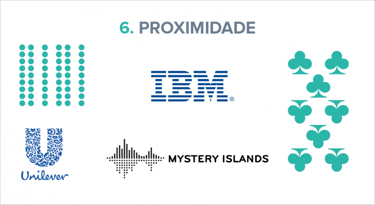
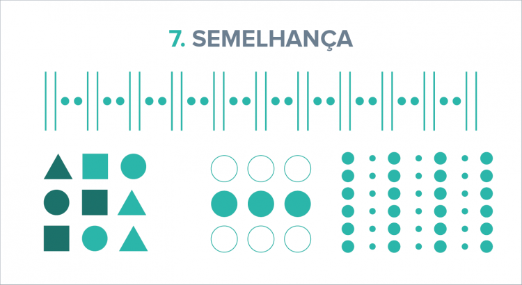
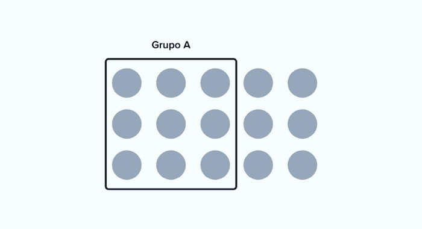
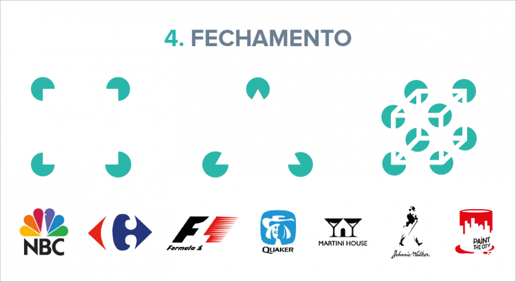
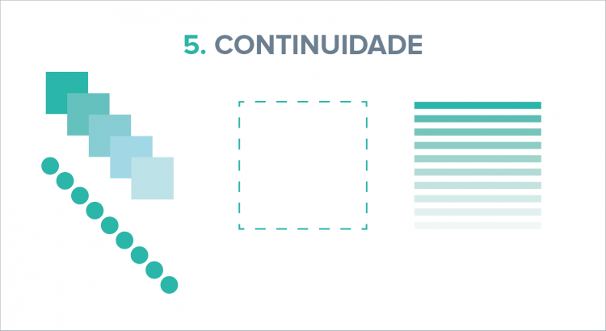

# Aula 01 - Storeteling

- O que é storytelling?

Na tradução livre é o "contação de histórias".

### Visualização de dados

- Comunicação
- Contexto

### Conceitos importantes

- Análise exploratória

> Exploração dos dados

- Análise explanatória

> Explicar o que foi feito, explicar os insigths que foram retirados dos dados após a análise exploratória

### Estruturando a apresentação

- Publico alvo

> Deve fazer sentido para quem está consumindo as informações

- Como vamos nos comunicar? (qual a abordagem)
- Qual é o tom que vamos usar?
- Como vamos usar os dados para expor as ideias?

# Aula 02 - Gestalt

## Principio de Gestalt

Teoria criada por Max Wertheimer, Wolfgang Kohler e Kurt Koffka. O principio auxilia a como interpretar e visualizar os dados e os gráficos.

### Proximidade

Elementos muito próximos uns dos outros, se encaixando harmoniosamente, são processados em nosso cérebro como elementos conjuntos, ou unidades.

### Similaridade

Elementos semelhantes em cor ou forma tendem a ser agrupados pelo cérebro em uma só unidade. Isso faz com que objetos aproximados, apenas com uma característica semelhante, se unam aos olhos do leitor.

### Acercamento (região comum)

Quando objetos são posicionados dentro da mesma região fechada, estes são percebidos como parte do mesmo grupo.

### Fechamento

O fechamento estabelece que o nosso cérebro tem a inclinação de fechar ou concluir formas que vemos inacabadas ou abertas. Isso se deve a padrões sensoriais e de ordem espacial que temos em nossa mente.

### Continuidade

A lei da continuidade diz respeito à maneira como a percepção do fluxo e sequência dos elementos funciona em nosso cérebro. Trata-se da tendência dos objetos em seguir uma linha de fluidez visual gradativa. Isso é feito através de formas, linhas, cores, profundidade, planos, etc. Se você enxerga elementos em uma composição de modo ininterrupto, essa peça tem uma boa continuidade.

### Ponto Focal

Qualquer elemento que se destaca visualmente captura e prende a atenção de quem está vendo.

### Referências - Príncipios de Gestalt

- [8 princípios da Gestalt para você criar bons conteúdos visuais](https://marketingdigital360.com.br/8-principios-da-gestalt/#:~:text=De%20acordo%20com%20a%20Gestalt,leitura%20de%20um%20s%C3%B3%20objeto.)
- [Teoria e principais leis da Gestalt: um estudo da forma](https://blog.revendakwg.com.br/inspiracao-design/teoria-e-principais-leis-da-gestalt-um-estudo-da-forma/)
- [Os 7 Princípios de Gestalt e Como Utilizá-los em Projetos de UI Design](https://medium.com/aela/os-7-princ%C3%ADpios-de-gestalt-e-como-utiliz%C3%A1-los-em-projetos-de-ui-design-46d6d832abf6)

### Quando usar gráfico Pizza

- Dados de categorias de gêneros homem/mulher/etc;
- Quantidade ou porcentagem de respostas de pesquisas de sim/não;
- Fumantes vs. não fumantes;
- Pessoas que preferem um ambiente urbano vs. pessoas que preferem um ambiente rural;
- Outros dados binários/dicotômicos.
